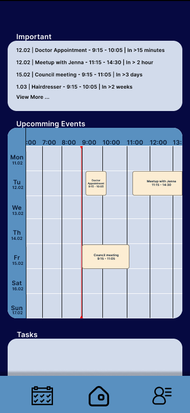

    <h1>Uni Schedule</h1>
    

        
        
        
        
    

    

        
        
        
    

    

        
        
        
    

    

        
    

    <h2>What Is The Origin Of The App?</h2>
    I have seen college schedules of my friends and -oh my- they were poorly made and unreadable. One made in MS paint, second in Excel, but the vertical length was such a pain to read when is the start of a class that I have used a RULLER to read the schedule. My idea was to build an app for them and their collegues so all of them can just look at the schedule and not spend minutes to read that evil files.

    <h2>Phases of Development - TDD</h2>
    <table style="margin-left: auto; margin-right: auto;">
        <th></th>
        <th>Backend  (CURRENT)</th>
        <th>Web Frontend</th>
        <th>Public Tests</th>
        <th>Mobile App</th>
        <tr>
            <td>1.</td>
            <td>Unit Tests</td>
            <td>Functional Design + Connection with Backend</td>
            <td><50 group of people are given up to 6 months of time to for testing purposes</td>
            <td>In Progress</td>
        </tr>
        <tr>
            <td>2.</td>
            <td>RBAC + Personal Data Security</td>
            <td>Dynamic Schedule and responsive display</td>
            <td>Collecting bug reports, feature ideas etc.</td>
            <td>In Progress</td>
        </tr>
        <tr>
            <td>3.</td>
            <td>Operations on Schedule</td>
            <td>Final Design</td>
            <td>Final Polishes and Hot Fixes + E2E Tests</td>
            <td>In Progress</td>
        </tr>
        <tr>
            <td>4.</td>
            <td>Securing endpoints + Login with Google account</td>
            <td>Integration Tests + Security of Inputs</td>
            <td>Public release of Alpha on Google play and Social Media Announcement</td>
            <td>In Progress</td>
        </tr>
    </table>

<!-- 
 -->

<!-- 

    <h2>Key Features</h2>
    - Third-party services like Supabase
    - Docker to mock database for testing purposes
    - Learning Dart and Flutter library to develop a mobile app
    - Ensuring compatibility and detection of vulnerabilities in code via pytest
    - SQLAlchemy as a ORM 
    - Ability to log in via Google credentials
    - Integration of both cloud and local storage to minimize database overload as well as reducing time user has to wait when getting updates on data

 -->

    <h2>Visual Concept</h2>
    

    <h2>What Security Measures Were Taken</h2>
    

        <h4>Anti-DDoS detection system <b>[IN PROGRESS]</b></h4>
        <h4>Anti-SQL Injection check on every input <b>[IN PROGRESS]</b></h4>
        <h4>Safe storage of sensible data by hashing them</h4>
        <h4>Preventing token fraud via numerous identification labels</h4>
        <h4>Automatic QA tests so the system is always running correctly</h4>
        <h4>RBAC (Role Based Access Control) Prevents unauthorized access <b>[IN PROGRESS]</b></h4>
        <h4>Logging suspicious activities, errors, invalid queries and ability to report a bug via form <b>[IN PROGRESS]</b></h4>
    

    <h2>Challenges and Solutions</h2>
    <h4>This Section is dedicated for challenges I run into during creation and maintenance of this app.   I'll explain what went wrong, why and how I managed to find a solution</h4>
    

        
Mocking database operations

        

            <pre>
#----Database and Session Setup----
@pytest.fixture
def db_session():
    connection = Testengine.connect()
    transaction = connection.begin()
    session = TestSessionLocal(
        bind=connection
        )
    session.begin_nested()
    try:
        yield session
    finally:
        session.close()
        transaction.rollback()
        connection.close()
            </pre>
        

        

            <h2 align="center">Mocking database operations</h2>
            <h4>
                At first I used external local Postgresql database for test. But found this solution overcomplicated as I would have to setup these tools on every machine I work on.    Current solution creates a <b>transaction</b> that stores every query during tests and rolls back every change it made. Tests don't leave marks on the database and don't interfere with user traffic
            </h4>
            <h3>Traffic in tests</h3>
            <ul>
                <li>Connection to the Database</li>
                <li>Opening Transaction</li>
                <li>Test logic</li>
                <li>Rollback changes no matter the outcome</li>
                <li>Close Session and Connection</li>
            </ul>
             
        

    

    <h2>Yes I Do Include Automatic Tests</h2>
    
This project includes more than 25 unit tests. They check both endpoints and business logic.   My setup mocks database so none of the operations made during tests stay on database.

    <h2>Tech Stack</h2>

